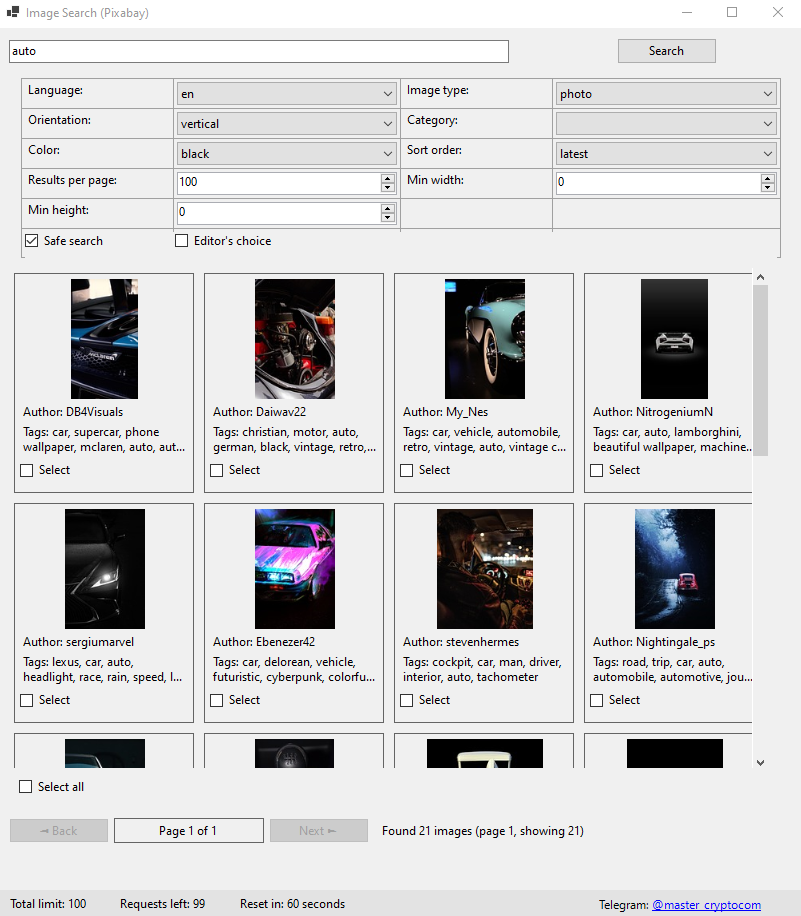
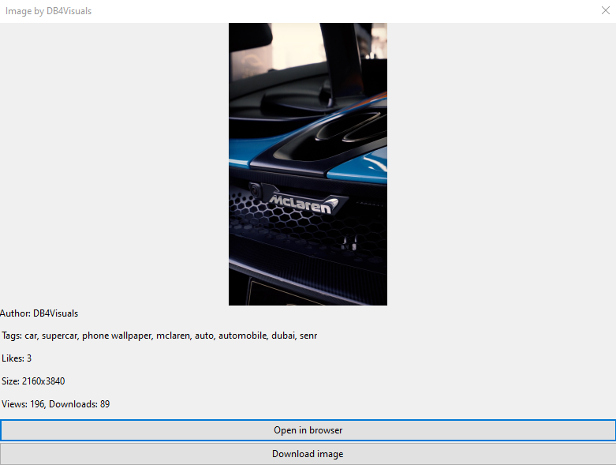
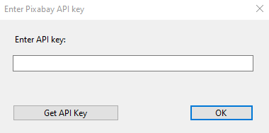

# 🖼️ Image Search Pixabay

> **More than 5.5 million free images, illustrations, vectors, and photos — royalty-free.**  
> This GUI application is designed for fast and efficient search and download of high-quality royalty-free images via the Pixabay API.

---

## 🔍 Search Filters

The application supports the following filtering options:

- **Language** — language for the search query or tags (e.g., `"en"`, `"cs"`, `"da"`, `"de"`, `"es"`, `"fr"`, `"id"`, `"it"`, `"hu"`, `"nl"`, `"no"`, `"pl"`, `"pt"`, `"ro"`, `"sk"`, `"fi"`, `"sv"`, `"tr"`, `"vi"`, `"th"`, `"bg"`, `"ru"`, `"el"`, `"ja"`, `"ko"`, `"zh"`). Default is `en`.

- **Orientation** — image orientation: `"all"`, `"horizontal"`, `"vertical"`.

- **Color** — dominant color in the image:
  `"all"`, `"grayscale"`, `"transparent"`, `"red"`, `"orange"`, `"yellow"`, `"green"`, `"turquoise"`, `"blue"`, `"lilac"`, `"pink"`, `"white"`, `"gray"`, `"black"`, `"brown"`.

- **Results per page** — number of preview results displayed (from `1` to `200`).

- **Image type** — content type: `"all"`, `"photo"`, `"illustration"`, `"vector"`.

- **Category** — refine your search using the following categories:  
  `"all"`, `"backgrounds"`, `"fashion"`, `"nature"`, `"science"`, `"education"`, `"feelings"`, `"health"`, `"people"`, `"religion"`, `"places"`, `"animals"`, `"industry"`, `"computer"`, `"food"`, `"sports"`, `"transportation"`, `"travel"`, `"buildings"`, `"business"`, `"music"`.

- **Sort order** — how results are sorted: `"popular"`, `"latest"`.

- **Min width/height** — minimum required dimensions in pixels (from `0` to `10,000`; `0` means any size is allowed).

---

## 🖼️ Preview Panel & Downloading

Inside the **Preview Panel**, you can:

- View detailed information about each image:
  - **Author** — the image’s creator (you can also search by author in the main search field)
  - **Tags** — descriptive tags, helpful for refining or exploring related content
  - **Likes** — the number of likes (less popular images may ensure greater uniqueness)
  - **Size** — image dimensions in pixels
  - **Views** — number of times the image has been viewed
  - **Downloads** — how many times the image has been downloaded

- Click **"Open in Browser"** to view the image on the source site.

- Click **"Download Image"** to download it directly.

- For batch processing, check the **"Select All"** checkbox beneath the preview panel. After selecting images, a **"Download Selected"** button will appear. All selected content will be saved in the `/Image` folder using a **timestamp-based suffix** to prevent filename collisions.

---

## 🚀 Quick Start

1. **Download** the repository and extract the `Pixabay_Image_64` folder.  
2. **Run** `Pixabay.exe`.

3. On first launch, enter your **Pixabay API key** (one-time setup).  
   If you don’t have a key, click **"Get API Key"** — this will redirect you to the [Pixabay API Page](https://pixabay.com/api/docs/).  
   Log in via Google and copy your API key.

---

## 🛠️ Tech Stack

- **Language:** C#
- **Platform:** Windows 64-bit
- **UI:** WinForms
- **API:** [Pixabay REST API](https://pixabay.com/api/docs/)

---

## 📄 License

This project is licensed under the [MIT License](LICENSE).  
You are free to use, modify, and distribute this software.

---

## 📬 Contact & Support

If you have ideas, questions, or suggestions, feel free to contact me on [Telegram](https://t.me/master_cryptocom)  
Made with ❤️ by **Cryptocom**
